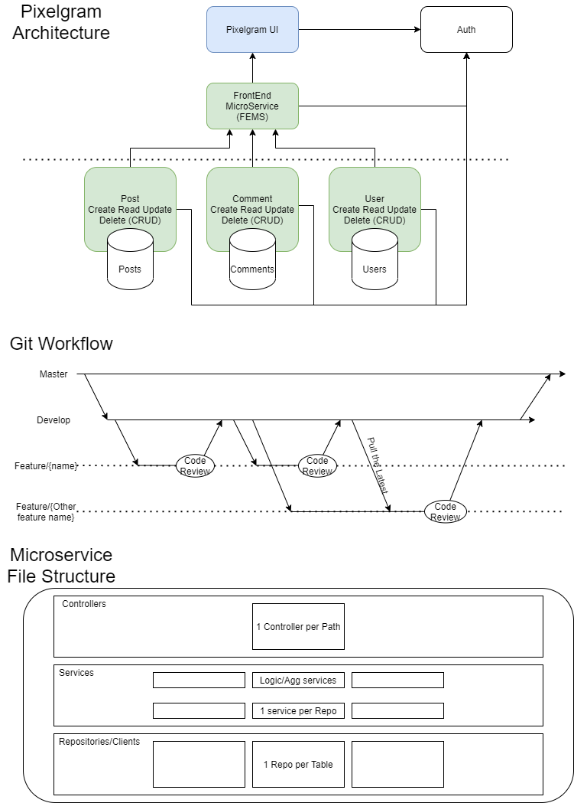

# documentation

lower-case-d documentation, meaning only basic shared information, subject to change.

## Table of Contents

[Mock-Ups](#mock-ups)

[General Architecture, Git Workflow, and Microservice Layout](#diagrams)

[Helpful Links](#helpful-links)

## Mock-Ups

[Click Here for Mock-Ups](https://www.figma.com/file/vVY5CsGpkpkGcRERCQiFFd/Instagram-Clone-Cognizant?node-id=0%3A1)

## Diagrams

Note: this may be outdated.

## Helpful Links

### Microservice Spin-Up Workshop links:
* General Spin-Up link: https://git.work.cognizant.studio/e-remote-enablement/curriculum/blob/master/MicroserviceSpinUpWorkShops/GradleGCPK8sMicroserviceSpinUpWorkShop.md
* Supplimental File for UI Pipeline prep: https://git.work.cognizant.studio/e-remote-enablement/curriculum/blob/master/SpringBootAngular.md

### Kpoint playlist links:
* General Playlist: https://cognizant.kpoint.com/app/video/gcc-d803dfff-1816-452f-8ae8-8b4335c3b751?playlist=8344
* Shariq's intro to GCP & Docker w/Pipeline prerequisites: https://cognizant.kpoint.com/app/video/gcc-ab3ef80f-98b0-4f7e-a93b-3048f1afd9e6?playlist=8344
* For those working on UI, how to get Spring-Cloud-Gateway working: https://cognizant.kpoint.com/app/video/gcc-6f80aba0-d057-454b-8a7c-e2d75be62b1c?playlist=8344
* Demo of TDD with Spring Controller: https://cognizant.kpoint.com/app/video/gcc-abe852c0-ae3d-44ae-8341-febfcbbe143c?playlist=8344
* Demo of TDD everywhere in a Angular Project: https://cognizant.kpoint.com/app/video/gcc-d1ab47cb-0399-439e-808b-6c3127d94e4e?playlist=8344

### Udemy
* General Link: https://cognizant.udemy.com/ 
* Helpful Spring:
    * https://cognizant.udemy.com/course/spring-boot-intro/learn/lecture/3994608#overview
    * https://cognizant.udemy.com/course/testing-spring-boot-beginner-to-guru/learn/lecture/12313150#overview
    * https://cognizant.udemy.com/course/microservices-with-spring-boot-and-spring-cloud/
* Helpful Angular:
    * https://cognizant.udemy.com/course/the-complete-guide-to-angular-2/learn/lecture/13914134#overview

### General Work:
* Enablement FAQs: https://git.work.cognizant.studio/e-remote-enablement/spring-curriculum/tree/master
* Bench FAQx: https://git.work.cognizant.studio/e-remote-enablement/spring-curriculum/blob/master/BenchFAQ.md
